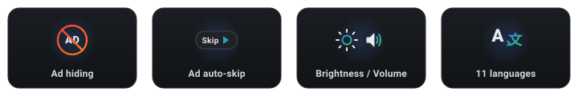

  

  
  
  
  

  A lightweight, dark-themed control panel that overlays on YouTube. It hides
  ad elements, skips skippable video ads, and adds quick page and playback
  controls, all from a single draggable panel available in eleven languages.

  

---

## Overview

ChillTube injects a compact panel into the YouTube interface. The panel mirrors
a clean dark theme and groups every control into three tabs: **Main** for the
toggles you reach for most, **More** for visual and playback tweaks, and
**Settings** for language and configuration. Everything you change is saved and
restored automatically on your next visit.

The script is intentionally self-contained. It performs no network requests of
its own, collects no data, and does not bundle or call any external download or
DRM-bypass service. The optional download button simply opens a site you choose
in a new tab.

## Features

The **Main** tab carries the core switches. *Ad hiding* removes display ad units
such as masthead banners, promoted feed items, sidebar ad slots, and in-player
overlay ads using a curated list of selectors that leave normal page content
untouched. *Auto-skip* watches the player and clicks YouTube's native skip
control the instant it becomes available; while the unskippable countdown is
still running, a Skip button appears over the player so you can force the ad to
its end yourself.

The **More** tab holds the adjustments. A brightness slider dims or lifts the
whole page, a contrast slider and a grayscale toggle change how the page renders,
and a volume slider sets the level of any video or audio on the page. You can
also loop the current video, set a fixed playback speed, and hide YouTube Shorts
shelves from the feed.

The **Settings** tab lets you switch the interface language and set the optional
downloader URL described below.

## Interface

The panel is draggable by its header and remembers where you place it, even when
you switch tabs. Minimize tucks it into a small floating button in the corner,
and the fullscreen control expands it for closer work. A restrained particle
layer drifts behind the panel for a little depth without distraction.

## Installation

First, install a userscript manager in your browser. Tampermonkey,
Violentmonkey, and Greasemonkey are all supported.

Once a manager is installed, the easiest way to add ChillTube is the one-click
install from GreasyFork:

  

Clicking the button opens the script page on GreasyFork. Press the green
**Install** button there and your userscript manager will pick it up and confirm
the installation. After that, open or refresh a YouTube tab and the panel
appears.

If you would rather install it by hand, open your manager's dashboard, choose
**Create a new script**, replace the template with the contents of
`chilltube.user.js`, and save.

To update, GreasyFork-installed scripts update automatically. A manual install
is updated by pasting the newer version over the old one and saving.

## Configuration

Most options live in the panel and persist on their own. Two items are worth
calling out.

**Site scope.** By default the script runs only on YouTube. The active scope is
controlled by the `@match` lines in the metadata block at the top of the file.
To run it elsewhere, add another line in that block, for example
`@match *://*.twitch.tv/*`. A line only takes effect if it begins with the
`@match` keyword.

**Downloader URL.** The download button opens an external site of your choosing
in a new tab and appends the current page address where you place the `{url}`
placeholder. Set it in the Settings tab, or edit the `DOWNLOADER_URL` constant
near the top of the script. It is empty by default; with no value set, the
button simply prompts you to configure one. The script itself does not download
media or remove watermarks.

## Languages

The interface is available in English, Italian, Spanish, French, German,
Portuguese, Russian, Simplified Chinese, Japanese, Arabic (right-to-left), and
Hindi. The language is detected from the browser on first run and can be changed
at any time in the Settings tab.

## Compatibility

ChillTube is written to run across Chromium-based browsers and Firefox through
any of the supported managers. It uses a Trusted-Types-safe rendering path so it
works on sites with strict content-security policies, and it re-injects itself
after in-page navigation so it stays present as you move between videos.

## Notes and limitations

Element-based ad hiding is cosmetic. For full network-level blocking, a
dedicated extension such as uBlock Origin remains the stronger tool, and the two
can run side by side. Video-ad skipping handles the common skippable and
countdown formats; some server-stitched ad formats resist every client-side
approach, so completeness cannot be guaranteed on those. Streaming sites also
change their markup over time, which can occasionally require selector updates.

## License

Released under the MIT License. See `LICENSE` for details.
