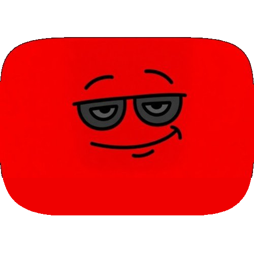
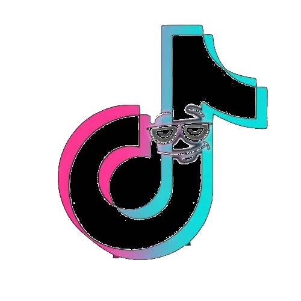

  

  
  
  
  

  A lightweight, dark-themed control panel that overlays on YouTube and TikTok.
  It hides ad and clutter elements, skips skippable video ads, and adds quick
  page and playback controls, all from a single draggable panel available in
  eleven languages. The panel rebrands and re-tools itself per site —
  <b>ChillTube</b> on YouTube, <b>ChillTok</b> on TikTok.

  

---

## Two faces of the same script

A single install handles both sites. The panel detects the host you are on and
swaps its identity, its logo, the features it shows, and where the download
button points:

<table align="center">
<tr>
  <td align="center" width="50%">
     
    <b>ChillTube</b> 
    <code>youtube.com</code> 
    Download via evdfrance.fr
  </td>
  <td align="center" width="50%">
     
    <b>ChillTok</b> 
    <code>tiktok.com</code> 
    Download via urlebird.com
  </td>
</tr>
</table>

Shared settings — language, brightness, volume, contrast, speed — carry across
both sites, so what you set once is remembered everywhere.

## Overview

ChillTube injects a compact panel into the YouTube and TikTok interface. The
panel mirrors a clean dark theme and groups every control into three tabs:
**Main** for the toggles you reach for most, **More** for visual and playback
tweaks, and **Settings** for language. Everything you change is saved and
restored automatically on your next visit.

The script is intentionally self-contained. It performs no network requests of
its own, collects no data, and does not bundle or call any external download or
DRM-bypass service. The download button simply opens an external site in a new
tab — evdfrance.fr on YouTube, urlebird.com on TikTok — and lets that site do
the work.

## Features on YouTube (ChillTube)

The **Main** tab carries the core switches. *Ad hiding* removes display ad
units such as masthead banners, promoted feed items, sidebar ad slots, and
in-player overlay ads using a curated list of selectors that leave normal page
content untouched. *Auto-skip* watches the player and clicks YouTube's native
skip control the instant it becomes available; while the unskippable countdown
is still running, a Skip button appears over the player so you can force the ad
to its end yourself. The **Download** button opens evdfrance.fr already loaded
with the current video ID, so the file is ready in one click.

The **More** tab adds visual and playback tweaks: brightness, contrast,
grayscale, volume, loop, a fixed playback speed, and a *Hide Shorts* toggle
that removes Shorts shelves from the feed.

## Features on TikTok (ChillTok)

On TikTok the panel shows a tailored set of controls instead of the
YouTube-specific ones:

- **Hide sponsored & app nags** — the Main-tab toggle hides sponsored/promoted
  posts in the feed, the "Get the app" banners, the sticky open-app bars, the
  login/signup nag modal, and the cookie banner.
- **Brightness, contrast, grayscale, volume, loop, speed** — all the visual and
  playback adjustments work the same as on YouTube.
- **Download** — opens urlebird.com on the matching path for whatever you are
  viewing, so the video, profile, or hashtag appears immediately on urlebird's
  mirror, where it can be saved watermark-free.

The YouTube-only controls (auto-skip, Hide Shorts) are hidden on TikTok since
they do not apply there.

## Interface

The panel is draggable by its header and remembers where you place it, even
when you switch tabs. Minimize tucks it into a small floating button in the
corner, and the fullscreen control expands it for closer work. A restrained
particle layer drifts behind the panel for a little depth without distraction.

## Installation

First, install a userscript manager in your browser. Tampermonkey,
Violentmonkey, and Greasemonkey are all supported.

Once a manager is installed, the easiest way to add ChillTube is the one-click
install from GreasyFork:

  

Clicking the button opens the script page on GreasyFork. Press the green
**Install** button there and your userscript manager will pick it up and
confirm the installation. After that, open or refresh a YouTube or TikTok tab
and the panel appears.

If you would rather install it by hand, open your manager's dashboard, choose
**Create a new script**, replace the template with the contents of
`chilltube.user.js`, and save.

To update, GreasyFork-installed scripts update automatically. A manual install
is updated by pasting the newer version over the old one and saving.

## Configuration

Most options live in the panel and persist on their own. A few items are worth
calling out.

**Site scope.** By default the script runs on YouTube and TikTok. The active
scope is controlled by the `@match` lines in the metadata block at the top of
the file. To add another site, add another line in that block, for example
`@match *://*.twitch.tv/*`. A line only takes effect if it begins with the
`@match` keyword.

**Per-site profile.** Near the top of the script there is a `SITES` object that
holds the brand name, logo, and downloader template for each supported site. To
change where the download button points on YouTube or TikTok, edit the
`downloader` field for the corresponding entry. Three placeholders are
supported in any template:

- `{id}` — the video ID, useful for `?id=` style downloaders (used on YouTube).
- `{path}` — the current page path including the query string, useful for
  mirror-style downloaders that re-host the same URL structure (this is how the
  TikTok ↔ urlebird redirect works).
- `{url}` — the full current page URL, URL-encoded.

If no placeholder is present, the current URL is appended to the template
as-is. The ChillTok logo is embedded directly in the script as a data URI,
because TikTok's content-security policy blocks images loaded from GitHub.

## Languages

The interface is available in English, Italian, Spanish, French, German,
Portuguese, Russian, Simplified Chinese, Japanese, Arabic (right-to-left), and
Hindi. The language is detected from the browser on first run and can be changed
at any time in the Settings tab.

## Compatibility

ChillTube is written to run across Chromium-based browsers and Firefox through
any of the supported managers. It uses a Trusted-Types-safe rendering path so it
works on sites with strict content-security policies, and it re-injects itself
after in-page navigation so it stays present as you move between videos.

## License

Released under the MIT License. See `LICENSE` for details.
